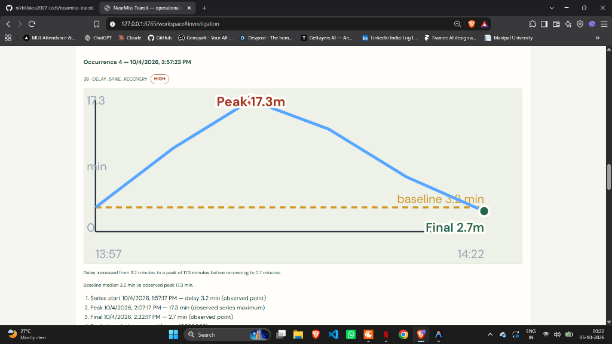
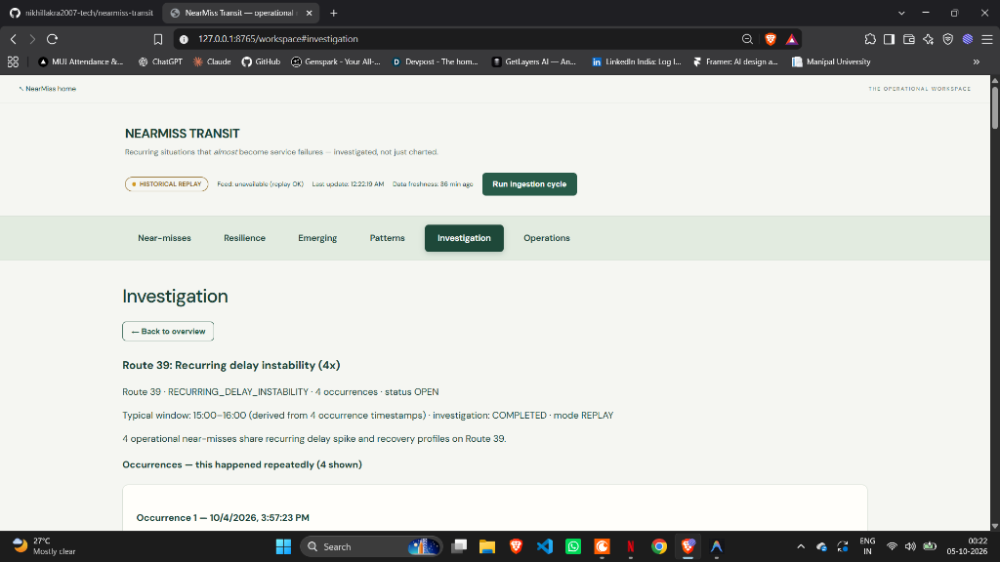
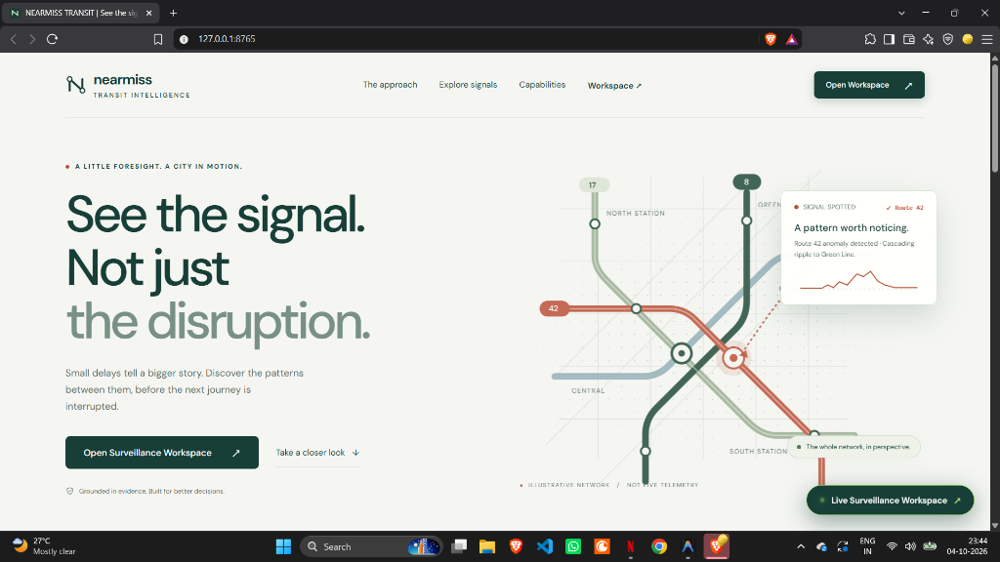
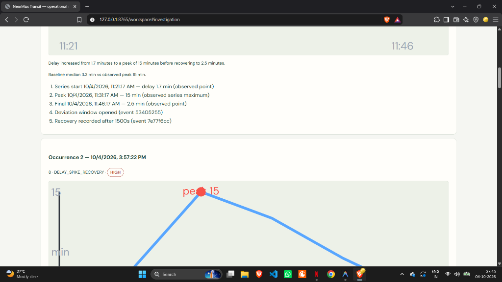

<div align="center">

# 🚊 NearMiss Transit — Operational Pre-Disruption Intelligence

### *See the recurring signals between normal service and system failure — before the next disruption occurs.*

<br/>

[](https://wcc-tawny.vercel.app)
[](https://wcc-tawny.vercel.app/workspace)
[](https://wcc-tawny.vercel.app/docs)

<br/>

[](https://fastapi.tiangolo.com)
[](https://python.org)
[](./frontend/components)
[](./frontend/css)
[](https://www.sqlalchemy.org/)
[](https://gtfs.org/realtime/)
[](https://wcc-tawny.vercel.app)
[](./frontend/components)

<br/>

[🌐 **Live Landing Page**](https://wcc-tawny.vercel.app) • [🛰️ **Surveillance Workspace**](https://wcc-tawny.vercel.app/workspace) • [📖 **Interactive API Docs**](https://wcc-tawny.vercel.app/docs) • [📁 **Frontend Components**](./frontend/components)

</div>

---

## 🔗 Live Deployments & Endpoints

| Environment | Service | Live URL | Status |
|---|---|---|---|
| **Production** | 🌐 Public Landing Page | [https://wcc-tawny.vercel.app](https://wcc-tawny.vercel.app) |  |
| **Operations** | 🛰️ Surveillance Workspace | [https://wcc-tawny.vercel.app/workspace](https://wcc-tawny.vercel.app/workspace) |  |
| **API Reference** | 📑 Interactive Swagger UI | [https://wcc-tawny.vercel.app/docs](https://wcc-tawny.vercel.app/docs) |  |
| **API Health** | 🩺 Telemetry & DB Health | [https://wcc-tawny.vercel.app/api/v1/health](https://wcc-tawny.vercel.app/api/v1/health) |  |
| **Ingestion Engine**| ⚡ Live / Replay Cycle Trigger | `POST /api/v1/ingestion/run` |  |

---

## 📸 Visual Showcase

### Surveillance Workspace & Real-Time Operational Intelligence


### Deep-Dive Investigation, Delay Timelines & Replay


### Interactive Landing Experience & Illustrative Transit Network


### Route Resilience Radar & Stress Scoring


---

## ⚡ The Core Problem

Transit control centers are flooded with delay alerts only **after** lines break down. 

**NearMiss Transit shifts surveillance upstream:**
- Most service deviations escalate, recover, and repeat quietly under standard thresholds.
- When two separate routes experience correlated micro-delays, they form a **domino chain** that cascades into gridlock.
- NearMiss Transit detects, correlates, forecasts, and simulates these near-misses in real time with 100% evidence-backed traceability.

```
DETECT ──> REMEMBER ──> CONNECT ──> FORECAST ──> REPLAY ──> SIMULATE ──> RECOMMEND ──> VERIFY
```

---

## 🛠️ Tech Stack & Engineering Matrix

| Layer | Badges & Technology | Purpose & Implementation |
|---|---|---|
| **Backend Core** | [](https://fastapi.tiangolo.com) [](https://python.org) [](https://www.uvicorn.org/) | High-performance asynchronous REST API, route handlers, dependency injection |
| **Data & ORM** | [](https://www.sqlalchemy.org/) [](https://alembic.sqlalchemy.org/) [](https://sqlite.org) | Declarative relational schema, pool pre-ping, auto-migrations, serverless `/tmp` fallback |
| **Telemetry Ingestion** | [](https://gtfs.org/realtime/) [](https://protobuf.dev/) | Live VehiclePositions & TripUpdates parsing, noise filtering, timestamp normalization |
| **Intelligence Services** | [](./backend/app/services/patterns) [](./backend/app/services/chains) [](./backend/app/services/forecast) | Deviation-escalation-recovery sequence detection, multi-hop temporal dominoes, risk scoring |
| **Frontend Architecture** | [](./frontend/components) [](./frontend/components) | Decoupled component architecture: zero giant monolithic script files, instant fault isolation |
| **Styling & Motion** | [](./frontend/css) [](./frontend/assets) [](./frontend/components/charts) | Bespoke typography, parallax network canvas, inline progression curves, zero UI frameworks |
| **Deployment & Edge** | [](https://vercel.com) [](https://vercel.com) | Serverless Python backend function (`api/index.py`) + edge-cached static distribution |

---

## 🏛️ Clean Architecture Breakdown

The project separates concerns strictly into deterministic core services and decoupled UI modules:

```
wcc/
├── backend/app/                 # FastAPI Core Services
│   ├── api/routes/              # REST Endpoints (health, nearmisses, patterns, forecast, etc.)
│   ├── core/                    # Config, security, and logging
│   ├── db/                      # SQLAlchemy session and models
│   ├── models/                  # Database entity schemas
│   └── services/                # Specialized intelligence engines
│       ├── ingestion/           # GTFS-RT normalization and ingestion
│       ├── detection/           # Near-miss detector (deviation + escalation + recovery)
│       ├── patterns/            # Pattern clustering and fingerprinting
│       ├── chains/              # Multi-hop domino association detector
│       ├── forecast/            # Early-warning risk score evaluator
│       └── counterfactual/      # What-if scenario intervention simulator
│
├── frontend/                    # Zero-Bloat Modular Frontend
│   ├── index.html               # High-impact illustrative landing page
│   ├── workspace.html           # Surveillance operations dashboard
│   ├── css/                     # Scoped stylesheets (landing, workspace, base)
│   └── components/              # Decoupled component architecture (1-2 files per folder)
│       ├── core/                # api-client.js, state-store.js
│       ├── charts/              # sparkline.js, timeline-chart.js
│       ├── status-bar/          # status-bar.js (telemetry health & ingestion trigger)
│       ├── nearmiss-feed/       # nearmiss-feed.js (active near-miss cards)
│       ├── resilience-radar/    # resilience-radar.js (stress scores by corridor)
│       ├── forecast-monitor/    # forecast-monitor.js (early-warning signals)
│       ├── pattern-catalog/     # pattern-catalog.js (recurring incident memory)
│       ├── investigation-panel/ # investigation-panel.js (timelines, replay & lab)
│       ├── operations-live/     # operations-live.js (GTFS vehicle/event telemetry)
│       ├── navigation/          # workspace-nav.js (smooth section tracking)
│       ├── landing-hero/        # hero-network.js (parallax SVG network scene)
│       └── landing-atlas/       # stage-atlas.js (interactive 3-stage atlas)
│
├── docs/                        # Architecture specs, verification docs & screenshots
├── scripts/                     # Seed utilities and simulation scripts
├── api/index.py                 # Vercel Serverless Function entrypoint
└── vercel.json                  # Vercel deployment routing configuration
```

---

## 🚀 Quickstart & Local Run

### 1. Clone & Set Up Virtual Environment

```bash
git clone https://github.com/nikhillakra2007-tech/nearmiss-transit.git
cd nearmiss-transit

python -m venv .venv
# On Windows:
.venv\Scripts\activate
# On Linux/macOS:
source .venv/bin/activate

pip install -r requirements.txt
```

### 2. Seed Demo Transit Telemetry (Optional)

```bash
python scripts/seed_demo.py
```

### 3. Start the Server

```bash
# Set demo mode for offline replay and simulation
# Windows PowerShell:
$env:DEMO_MODE="true"; python -m uvicorn backend.app.main:app --host 127.0.0.1 --port 8765

# Linux / macOS:
DEMO_MODE=true python -m uvicorn backend.app.main:app --host 127.0.0.1 --port 8765
```

- **Landing Page:** [http://127.0.0.1:8765/](http://127.0.0.1:8765/)
- **Surveillance Workspace:** [http://127.0.0.1:8765/workspace](http://127.0.0.1:8765/workspace)
- **Interactive OpenAPI Docs:** [http://127.0.0.1:8765/docs](http://127.0.0.1:8765/docs)

---

## 🔬 Intelligence Modules

### 1. Near-Miss Signature Detector
Does not rely on a simple `delay > X` rule. Identifies genuine operational signatures consisting of:
- **Deviation Window** (initial departure from normal run-time)
- **Escalation Phase** (steepening delay gradient)
- **Recovery Event** (stabilization before terminal delay)

### 2. Domino Chains & Multi-Hop Propagation
Tracks cross-route dependencies (e.g., `Route 42 → Lightrail Green-E → Route 1`). Computes recurrence strength, average temporal gap, and confidence without conflating correlation with causation.

### 3. Counterfactual Simulation Lab
Simulate operational interventions directly against observed telemetry:
- *Reduce peak delay by X%*
- *Trigger recovery N minutes earlier*
- *Reduce recovery duration by X%*
View side-by-side SVG comparison graphs with modeled outcome metrics.

---

## 🌐 Deploy to Vercel

The project includes built-in Vercel configuration (`vercel.json` + `api/index.py`).

```bash
npm i -g vercel
vercel --prod
```

**Live Production Link:** [https://wcc-tawny.vercel.app](https://wcc-tawny.vercel.app)

---

## 📄 License
MIT License. Built for resilient, evidence-grounded municipal transit intelligence.
