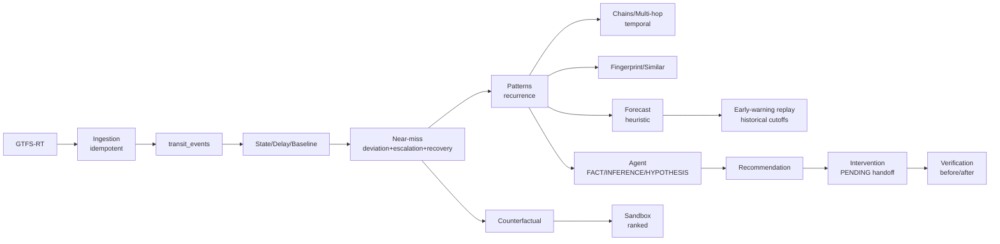

# System overview (V2.6)

Modular monolith: `core` / `db` (15 tables) / `schemas` / `repositories` /
`services` (ingestion, transit, detection, patterns, investigation, agent,
recommendations, interventions, verification, chains, counterfactual,
fingerprints, forecast, replay, resilience, sandbox) / `api` (`/api/v1`) /
`workers`.
Static frontend served at `/`.

Deterministic system owns facts/scores/simulations; agent explains evidence;
DB is memory; workers observe; verification closes the loop. Live feeds
untrusted input; LLM output untrusted, validated, never executed.
